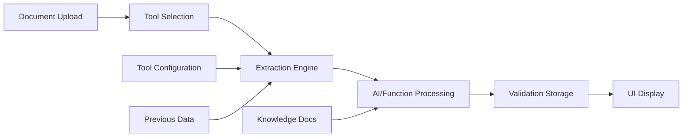

# extrapl - AI-Powered Document Data Extraction Platform

## Overview
extrapl is an AI-powered document data extraction platform for legal and business documents, offering enhanced conflict detection and collaborative workspaces. It allows users to configure extraction schemas, upload documents, and review AI-analyzed data with knowledge-based validation. The platform streamlines data extraction from complex documents, reducing manual effort and improving accuracy, with significant market potential.

## User Preferences
- **Communication style**: Simple, everyday language
- **UI/UX approach**: Clean, professional interface with slate blue (#4F63A4) theming
- **Development philosophy**: Architecture-first, no patchy workarounds

## 🏗️ Core Architecture Principles

### 1. Identifier-Based Data Mapping
**CRITICAL**: All data relationships MUST be mapped through UUIDs (identifierIds), never array indices.

```typescript
// CORRECT: Map by identifierId
const recordMap = new Map(data.map(r => [r.identifierId, r]));
const record = recordMap.get(validation.identifierId);

// WRONG: Never use array indices
const record = data[index]; // FORBIDDEN
```

**Rationale**: Array indices are unstable and change with filtering/sorting. UUIDs provide stable, permanent references.

### 2. Tool-Based Extraction Architecture
**CRITICAL**: Each value uses ONLY its assigned tool (via toolId). No exceptions.

```typescript
// Each stepValue has exactly ONE tool assigned
interface StepValue {
  id: string;
  toolId: string;  // This tool and ONLY this tool extracts this value
  // ...
}
```

**Rules**:
- Tools are configuration-driven, not hardcoded
- A value's toolId is immutable once set
- Extraction functions are generic and tool-agnostic
- Tool selection happens at configuration time, not runtime

### 3. Multi-Field vs Single-Field Extraction
**CRITICAL**: Different extraction patterns for different step types.

#### Info Page Steps (Multi-Field)
- A single value can contain multiple fields
- Fields are extracted together in one AI call
- Each field gets its own validation record with unique identifierId
- Fields share the parent value's UUID as fieldId

```typescript
// Info Page value with multiple fields
{
  id: "value-uuid",
  valueName: "Report Info",
  fields: [
    { name: "Title", dataType: "Text", identifierId: "field1-uuid" },
    { name: "Date", dataType: "Date", identifierId: "field2-uuid" },
    { name: "Author", dataType: "Text", identifierId: "field3-uuid" }
  ]
}
```

#### Data Table Steps (Single-Field)
- Each value represents exactly one column
- One extraction call per column
- Direct 1:1 mapping between value and validation

### 4. Data Flow Integrity
**CRITICAL**: Data order and relationships must be preserved throughout the pipeline.

```
Source Document → Extraction → Validation Storage → Display
       ↓              ↓              ↓                ↓
  Original Order  Same Order    Same Order      Same Order
```

**Rules**:
- Never re-sort data on the frontend if backend provides order
- Use orderIndex from database for column sequencing
- Preserve identifierIds through all transformations
- First column identifierIds are generated at save time, not extraction

### 5. Unified Database Architecture
**CRITICAL**: Consistent treatment of schema fields and collections as "steps" with "values".

```typescript
// Everything is a workflow step with values
workflow_steps: {
  id: UUID
  stepName: string      // "CSPs", "Report Info", etc.
  stepType: "infoPage" | "dataTable"
  valueCount: number    // Number of records/rows
}

step_values: {
  id: UUID
  stepId: UUID         // References workflow_steps
  valueName: string    // Column/field name
  toolId: UUID        // Assigned extraction tool
  orderIndex: number  // Display order
  fields?: Field[]    // Multi-field support for Info Pages
}
```

## 📁 System Architecture

### Data Extraction Pipeline



### Key Components

#### 1. Tool Engine (`server/toolEngine.ts`)
**Purpose**: Orchestrates extraction using assigned tools
**Critical Functions**:
- `prepareInputs()`: Prepares data while preserving metadata
- `executeExtraction()`: Routes to appropriate extraction method

**Architecture Rules**:
- MUST preserve `__infoPageFields` metadata through pipeline
- MUST use tool assigned to value, never switch tools
- MUST handle both AI and Function extraction types

#### 2. Extraction Wizardry (`extraction_wizardry.py`)
**Purpose**: Unified extraction system for all tools
**Critical Functions**:
- `extract_with_ai()`: AI-powered extraction
- `execute_function()`: Function-based extraction

**Architecture Rules**:
- NEVER generates identifierIds (only extracts values)
- MUST map results back using provided identifierIds
- MUST handle multi-field extraction for Info Pages

#### 3. Storage Layer (`server/storage.ts`)
**Purpose**: Database operations and data persistence
**Critical Functions**:
- `getStepValues()`: Returns values ordered by orderIndex
- `saveValidations()`: Stores extraction results

**Architecture Rules**:
- MUST generate UUIDs for first column identifierIds
- MUST preserve orderIndex for display sequencing
- MUST handle multi-field validation storage

#### 4. Session View (`client/src/pages/SessionView.tsx`)
**Purpose**: Main UI for extraction sessions
**Critical Functions**:
- Column extraction workflow
- Field validation display
- Data table rendering

**Architecture Rules**:
- MUST NOT re-sort backend-ordered data
- MUST use identifierId for all data lookups
- MUST preserve extraction modal states

### Critical Data Structures

#### Validation Record
```typescript
interface FieldValidation {
  id: string;                    // Validation record ID
  fieldId: string;               // Parent value ID (or field UUID)
  identifierId: string;          // Row/record identifier
  extractedValue: string;        // Extracted data
  validationStatus: "valid" | "invalid" | "pending";
  // ... additional fields
}
```

#### Extraction Request
```typescript
interface ExtractionRequest {
  stepId: string;               // Workflow step ID
  valueId: string;              // Step value ID
  previousData: any[];          // Input data with identifierIds
  documentId?: string;          // Source document
  __infoPageFields?: Field[];  // CRITICAL: Must be preserved
}
```

## 🔒 Development Rules & Principles

### Core Architectural Rules
1. **NEVER hardcode fixes** - All solutions must respect the existing architecture
2. **Suggest before implementing** - Propose changes and explain the approach before making them
3. **Maintain data flow integrity** - Respect the established data pipeline: extraction → validation → display
4. **Preserve existing patterns** - Follow established coding patterns and conventions in the codebase
5. **No patchy workarounds** - Address root causes, not symptoms

### Code Modification Guidelines
1. **Investigate thoroughly first** - Understand the complete data flow before proposing changes
2. **Respect the unified architecture** - Maintain consistency with workflow_steps and step_values tables
3. **Trust AI outputs** - Assume AI is correct; fix data processing, not prompts
4. **Maintain identifier consistency** - Use identifierId as the primary linking mechanism across all systems
5. **No arbitrary reordering** - Preserve original data order throughout the pipeline

### Communication Protocol
1. **Explain the issue** - Clearly identify what's wrong and why
2. **Propose the solution** - Describe the fix and its architectural impact
3. **Wait for approval** - Get confirmation before implementing changes
4. **Test thoroughly** - Verify changes work without breaking existing functionality
5. **Document significant changes** - Update this file with architectural decisions

### Data Integrity Rules
1. **Maintain order consistency** - Data order from source must be preserved through extraction, storage, and display
2. **Use proper identifiers** - Always use identifierId for row mapping, not array indices
3. **Respect validation states** - Don't modify validated records unless explicitly requested
4. **Preserve extraction context** - Keep reference documents and parameters intact

### Tool & Extraction Rules
1. **Tools are configuration-driven** - No hardcoded tool-specific logic
2. **Extraction is generic** - All tools follow the same extraction pattern
3. **AI prompts are data** - Store prompts in database, not in code
4. **Functions are reusable** - Excel wizardry functions must work across different contexts
5. **Tool assignments are immutable** - A value uses its assigned tool, period

## 🚀 Recent Architectural Improvements

### Multi-Field Extraction Fix (2024)
**Problem**: Multi-field metadata was being lost during extraction
**Solution**: Preserve `__infoPageFields` through the entire pipeline
**Impact**: Info Page steps now correctly extract multiple fields in single AI call

### Column Ordering Fix (2024)
**Problem**: Frontend was re-sorting columns, disrupting database order
**Solution**: Remove client-side sorting, trust backend orderIndex
**Impact**: Columns now maintain their creation order consistently

### Loading State Consistency (2024)
**Problem**: Different loading animations for different extraction types
**Solution**: Unified loading overlay with spinner and progress text
**Impact**: Consistent user experience across all extraction modals

### Dark Mode Optimization (2024)
**Problem**: Extraction modal had poor contrast in dark mode
**Solution**: Comprehensive dark mode styling with proper color tokens
**Impact**: Full dark mode support across the application

## 🎨 UI/UX Architecture

### Design System
- **Primary Color**: Slate blue (#4F63A4)
- **Dark Mode**: Comprehensive theming with gray-800 backgrounds
- **Loading States**: Overlay with spinner and pulsing dots animation
- **Validation Icons**: Tick-based verification with color coding

### Component Architecture
- **Modals**: Extraction wizards with collapsible sections
- **Tables**: Fixed column widths with proper overflow handling
- **Forms**: React Hook Form with Zod validation
- **Navigation**: Wouter-based routing with dynamic titles

## 📊 Database Schema

### Core Tables
```sql
-- Workflow steps (Info Pages and Data Tables)
workflow_steps: {
  id: UUID PRIMARY KEY,
  project_id: UUID,
  step_name: VARCHAR,
  step_type: VARCHAR,
  value_count: INTEGER,
  identifier_id: UUID  -- For first column reference
}

-- Step values (columns/fields)
step_values: {
  id: UUID PRIMARY KEY,
  step_id: UUID REFERENCES workflow_steps,
  value_name: VARCHAR,
  tool_id: UUID,
  order_index: INTEGER,
  input_values: JSONB,
  fields: JSONB  -- Multi-field support
}

-- Field validations (extracted data)
field_validations: {
  id: UUID PRIMARY KEY,
  field_id: UUID,  -- Parent value ID
  identifier_id: UUID,  -- Row identifier
  extracted_value: TEXT,
  validation_status: VARCHAR,
  ai_reasoning: TEXT,
  confidence_score: INTEGER
}
```

## 🔧 Technical Stack

### Frontend
- **Framework**: React 18 with TypeScript
- **Styling**: Tailwind CSS with shadcn/ui components
- **State Management**: TanStack Query v5
- **Routing**: Wouter
- **Forms**: React Hook Form with Zod validation
- **Build Tool**: Vite

### Backend
- **Runtime**: Node.js with Express
- **Language**: TypeScript with ESM modules
- **Database**: PostgreSQL with Drizzle ORM
- **AI Integration**: Google Gemini API
- **Document Processing**: Python services for PDF/Excel
- **Session Management**: connect-pg-simple

### Infrastructure
- **Deployment**: Replit platform
- **Database Hosting**: Neon (PostgreSQL)
- **Environment**: NixOS distribution
- **Package Management**: npm/pip

## 🛠️ Development Workflow

### Adding New Features
1. Update schema in `shared/schema.ts`
2. Run `npm run db:push` for migrations
3. Update storage interface in `server/storage.ts`
4. Implement API routes in `server/routes.ts`
5. Add UI components following existing patterns
6. Test extraction pipeline end-to-end

### Debugging Extraction Issues
1. Check tool assignment in database
2. Verify identifierId mapping
3. Inspect `__infoPageFields` preservation
4. Review AI prompt construction
5. Validate result mapping

### Common Pitfalls to Avoid
- Never use array indices for data relationships
- Don't re-sort data that's already ordered
- Always preserve metadata through transformations
- Never switch tools during extraction
- Don't generate identifierIds in extraction functions

## 📝 Knowledge Base Summary

This documentation serves as the authoritative reference for the extrapl platform architecture. Key takeaways:

1. **Identity is Everything**: UUID-based mapping is non-negotiable
2. **Tools are Sacred**: Each value uses only its assigned tool
3. **Order Matters**: Data sequence must be preserved throughout
4. **Architecture First**: No quick fixes that violate core principles
5. **Metadata is Critical**: Preserve all metadata through pipelines

When in doubt, refer to these architecture principles. They are the foundation of system stability and reliability.